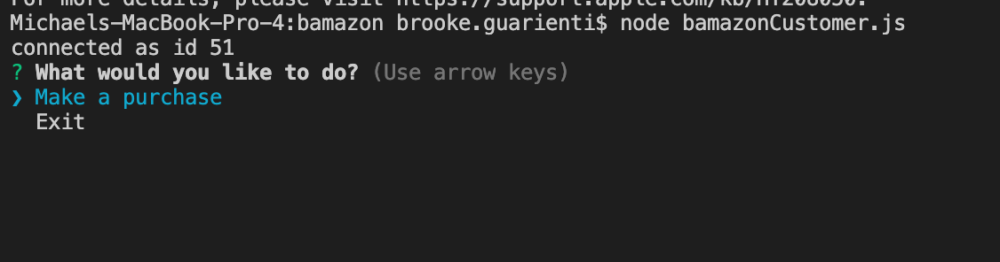

# bamazon
This application is an Amazon-like storefront that will take in orders from customers and deplete stock from the store's inventory.

#### The Prompts
The user will first open the terminal and navigate to the javascript file.

Then, enter the following:

  ```node bamazonCustomer.js```
   
  

