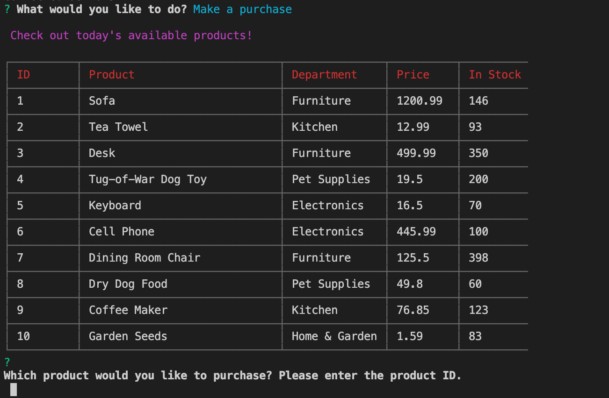
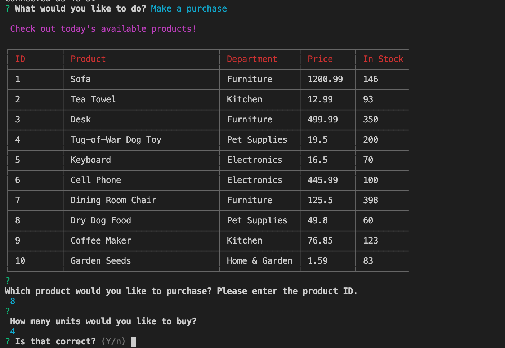
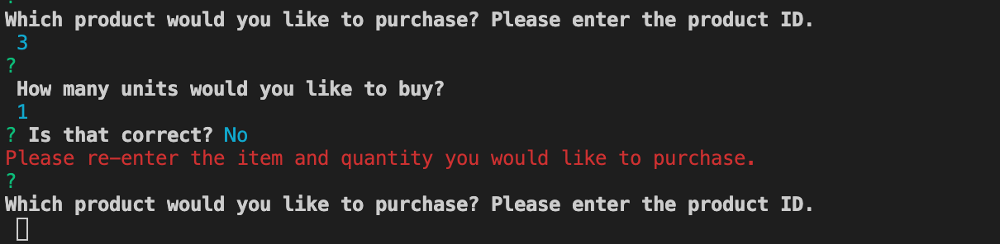
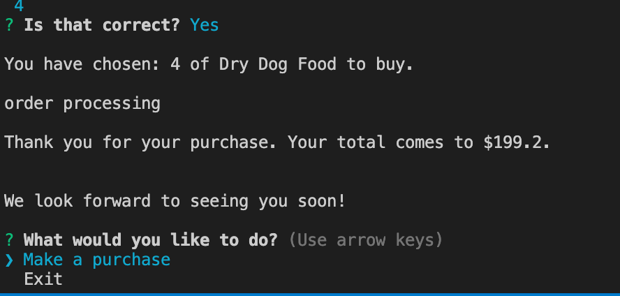
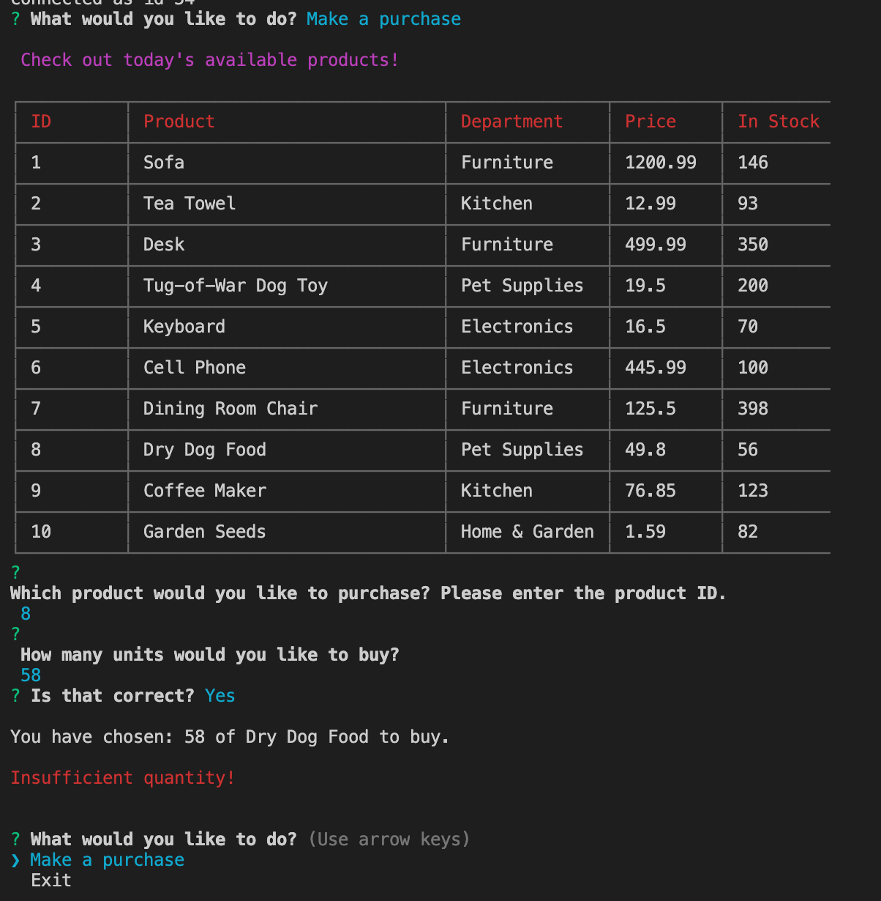
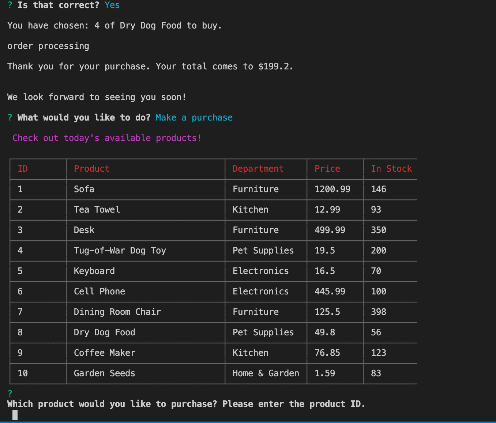
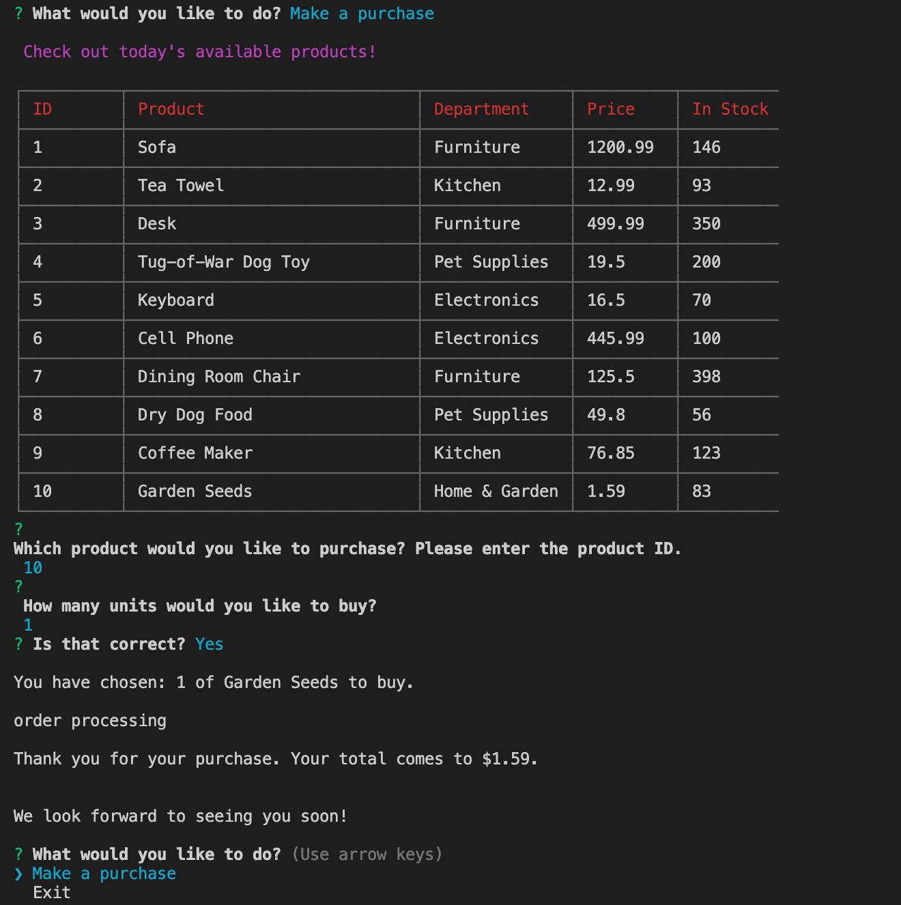

# Welcome to Bamazon!
This application is an Amazon-like storefront that will take in orders from customers and deplete stock from the store's inventory.

## The Prompts
The user will first open the terminal and navigate to the javascript file.

Then, enter the following:

  ```node bamazonCustomer.js```
  
The user is prompted to either:
  * "Make a purchase", or 
  * "Exit"
   
   


### Make a Purchase
If the user selects "Make a purchase", they will see the following:

   
   
The user will then be prompted to select an item based by typing in the item ID.

After the item ID is entered, the user is prompted to select the quantity of items the user would like to purchase.


### Confirm the order
The user is then prompted to confirm the order.

   


### Confirmation: No
If the user is not satisfied with the order, and selects "N", the program will ask the user to re-enter item and quantity.

   
 
 
 
### Confirmation: Yes
If the user is satisfied with the order, and selects "Y", the screen will return with the item and quantity purchased, order processing, and total purchase price. Then, the user is prompted to either make another purchase or exit.
 
   
 
 

### Insufficient Quantity
If the user enters a quantity that exceeds the available amount, the app will return the message "Insufficient quantity!"

   
  
  
  
###  Make another purchase
If user chooses to make another purchase: *note the change in available quantity from previous item purchased.*

   


The process will repeat until the user decides they are finished

   


### Exit app
If the user chooses to exit, they will see the below:

   


## Technologies used
* Javascript
* Nodejs
* Node packages
    * Chalk 
    * CLI-Table3
    * Inquirer
    * MySQL
    * Prompt
* MySQL and MySQL Workbench 
* Git
* GitHub

#### Collaborated with 
* John Pendergrass 
* Amy Haerr 
* Haylee McLemore
